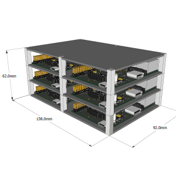
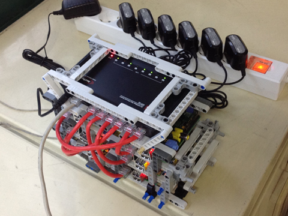

# Raspberry Pi cluster computer

## 목적



라즈베리 파이(Raspberry Pi)는 교육용으로 제작된 초소형, 초저가 PC이다. 라즈베리 파이는 가격이 저렴하므로 적은 돈으로 병렬 컴퓨터를 구성하는데 매우 유용하다. 본 프로젝트는 라즈베리 파이 6대와 허브를 가지고 병렬 컴퓨터를 제작하는 것이 목적이다.

## 방법

### 1. Raspbian 설치

[Raspbian 다운로드]: https://www.raspberrypi.org/software/operating-systems/	"Raspbian 링크"

SD카드를 PC에 연결하고 Raspbian을 다운받는다. 각각의 라즈베리 파이에 SD카드를 연결하고 Raspbian을 설치한다.

### 2. 허브 연결



랜선으로 하나의 허브에 각각의 라즈베리 파이를 연결한다.

### 3. ip 주소 고정

허브를 이용할 경우 재부팅시 ip 주소가 새로 할당된다. 병렬 컴퓨터에서는 서로의 ip 주소를 알아야 통신이 가능하므로 ip주소를 고정해주어야 재부팅을 해도 통신이 가능하다.

6대의 라즈베리 파이 중 1대를 서버 PC로 정하고, 서버 PC의 /etc/interfaces을 다음과 같이 수정한다.

```bash
auto lo

iface lo inet loopback

auto eth0
iface eth0 inet static
address 192.168.0.11
network 192.168.0.0
netmask 255.255.255.0
broadcast 192.168.0.255
dns-nameserver 192.168.0.11

auto eth0:0
iface eth0:0 inet static
address 210.219.52.148
netmask 255.255.255.0
gateway 210.219.52.1

allow-hotplug wlan0
iface wlan0 inet manual
wpa-roam /etc/wpa_supplicant/wpa_supplicant.conf
iface default inet dhcp
```

나머지 클라이언트 PC도 /etc/interfaces 파일을 다음과 같이 변경한다. 단 5번째 줄의 address 부분은 각각의 라즈베리 파이마다 192.168.12 ~ 의 서로 다른 주소를 지정해주어야 한다.

```bash
auto lo

iface lo inet loopback
iface eth0 inet static
address 192.168.0.12
network 192.168.0.0
netmask 255.255.255.0
broadcast 192.168.0.255
dns-nameserver 192.168.0.11
gateway 192.168.0.11

allow-hotplug wlan0
iface wlan0 inet manual
wpa-roam /etc/wpa_supplicant/wpa_supplicant.conf
iface default inet dhcp
```

### 4. /etc/hosts 등록

각각의 라즈베리 파이의 /etc/hosts 파일에는 ip 주소와 도메인 이름이 저장되어 있다. 새로운 ip 주소와 도메인 이름을 입력하면 ip 주소 대신 도메인 이름을 이용하여 다른 컴퓨터에 접속이 가능하다. /etc/hosts 파일에 위에서 고정한 ip 주소와 도메인 이름을 입력한다.

### 5. /etc/fstab 복사

/etc/hosts에 ip 주소와 도메인 이름을 입력했다면, ssh를 이용하여 도메인 이름만 입력하여도 다른 라즈베리 파이에 접속할 수 있다. 다만 최초 접속시에는 계정 비밀번호를 입력해야 다른 라즈베리 파이에 접속할 수 있다. 이는 authorized key가 다르기 때문이다. 따라서 라즈베리 파이의 부팅시 동기화를 통해 authorized key를 통일해주어야 비밀번호 입력 없이 원활한 통신이 가능하다.

/etc/fstab는 리눅스의 부팅시 마운트 정보를 갖고 있다. 부팅시 서버 PC의 authorized key를 동기화시키기 위해 /etc/fstab에 다음 코드 한 줄을 추가한다. 단, server_name은 서버 PC의 도메인 이름으로 변경한다.

```bash
server_name:/home /home/ nfs _netdev,auto 0 0
```

### 6. 소결

이제 라즈베리 파이 병렬 컴퓨터 구성을 완료하였다.

## 예제

### 1. 실행 방법

